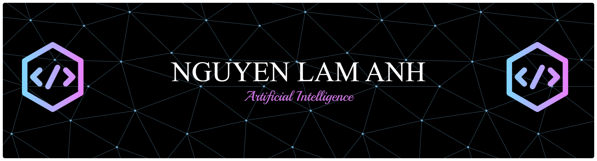

<!-- BANNER -->

  

<h1 align="center">Hi, I'm Nguyễn Lâm Anh (linanguyen05)</h1>
<h3 align="center">🚀 Machine Learning Engineer | 🧠 Deep Learning | 📊 Data Science | ☁️ Cloud</h3>

  
  
  

---

- 🎓 Senior AI major at **FPT University** (expected 2027)
- 🔍 Passionate about **Deep Learning**, **Multimodal Retrieval**, **RAG systems**, and **serverless AI deployment** on AWS
- 🧠 Currently leading research on **MuVi Search** – a late-fusion framework for Vietnamese multimodal video retrieval (SigLIP, FAISS, QLoRA)
- ⚙️ Experienced in fine-tuning ML/DL models, building production-ready pipelines, and CI/CD (GitHub Actions)

---

### 🛠️ Tech Stack (Badges Động)

#### 🤖 Machine Learning / Deep Learning

#### 🗄️ Data & Database

#### ☁️ Cloud

#### 🌐 Frontend & Tools

---

### 📌 Pinned Projects 

| Project | Description | Tech |
|---------|-------------|------|
| [**MuVi Search**](https://github.com/linanguyen05/muvi-search) *(private / ongoing)* | Modular late-fusion framework for Vietnamese multimodal video retrieval. OCR lead – unified encoding with SigLIP, FAISS indexing, QLoRA fine-tuning. | PyTorch, SigLIP, FAISS, VietOCR, Qwen2.5 |
| [**SorcererXStreme**](https://github.com/linanguyen05/SorcererXStreme-frontend) | RAG‑based spiritual consultation platform – full‑stack with AWS Bedrock, Pinecone, and glass‑morphism UI. | Next.js, TypeScript, AWS (Lambda, API Gateway, Cognito), Pinecone |
| [**Plant Disease Detection**](https://github.com/linanguyen05/plant_disease_detection) | Fine‑tuned DINOv2 vs lightweight models (CAS‑ViT, SimCLR) on plant leaf images. Grad‑CAM visualization for interpretability. | PyTorch, HuggingFace, DINOv2, Grad‑CAM |

---

### 📈 GitHub Stats 

  
  

  

<!-- 

  

 -->
